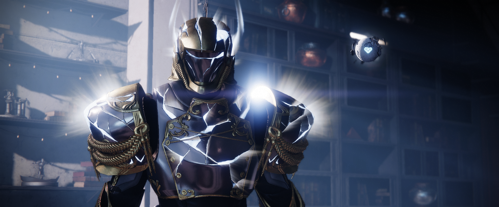

    

 

Hello there! 👋

My name is Michael, a Software Engineer by trade and a nerd by pretty much everything else. Thanks for stopping by.

Most of my programming experience is in backend systems. I work with **C++**, **Java**, **Python**, and **JavaScript**/**TypeScript**, but I am always experimenting with new languages and technologies.

I enjoy working on [Internet Relay Chat](https://en.wikipedia.org/wiki/Internet_Relay_Chat) (IRC) projects as a hobby. In fact, that is how I got into programming in the first place: I wanted to modify my IRC network's [IRC daemon](https://github.com/inspircd). C++ is the first programming language I learned. While some may consider C++ as getting into programming "the hard way," I enjoy it.

Outside of programming, I enjoy playing video games, spending time with friends and family, and spending a little time outdoors. If you want to get in touch with me, send me an email or message me on IRC. I am `Techman` on [Techtronix](https://www.techtronix.net/) and most other networks (including [Libera.Chat](https://libera.chat/)).
